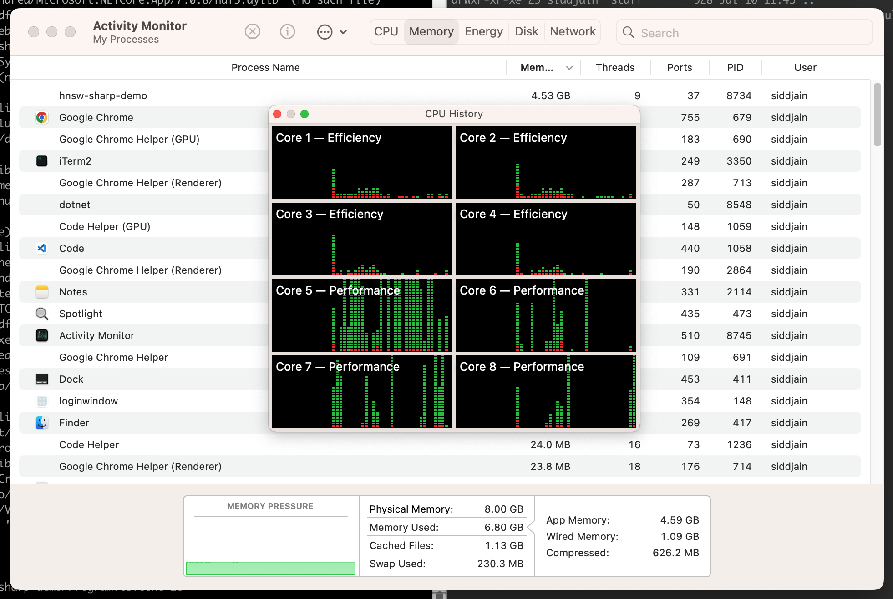
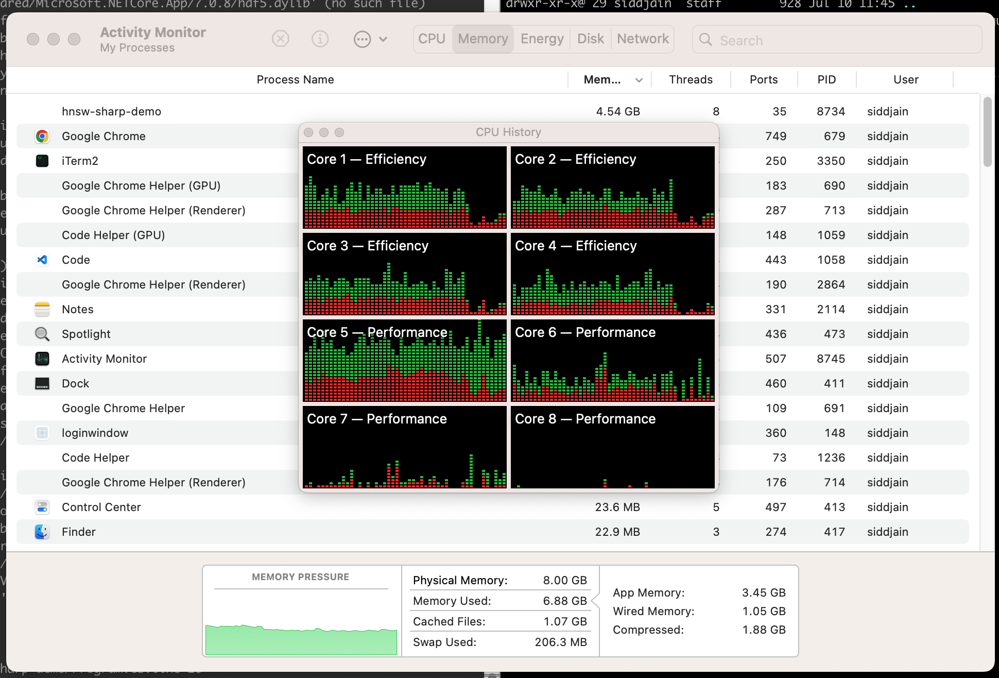

# README.md

Purpose: Compare the performance and accuracy of `hnsw-sharp` with `hnswlib` (C++ implementation) using the `glove-100-angular` dataset.

## Notes for self 

To create a new C# console app, run:

```
dotnet new console
```

the project was bootstrapped using above command.

## Pre-requisites

Download the dataset from:

```
wget http://ann-benchmarks.com/glove-100-angular.hdf5
```

This should give `485 MB` file:

```
-rw-r--r--@  1 siddjain  staff  485413888 Jul 10 11:42 glove-100-angular.hdf5
```

Install `libhdf5.dylib`. On Mac OS you can do so by running:

```
brew install hdf5
```

[install log](https://gist.github.com/siddhsql/f09088933261ee203804c2e2f0a90e39)

On Mac Mini the library was installed in `/opt/homebrew/lib`. we will need this path when running the program. verify:

```
..[$] <( (git)-[mychanges]-)> ls -al /opt/homebrew/lib/libhdf5.dylib
lrwxr-xr-x@ 1 siddjain  admin  39 Jul 10 17:34 /opt/homebrew/lib/libhdf5.dylib -> ../Cellar/hdf5/1.14.1/lib/libhdf5.dylib
```

## To run

Edit `Program.cs` and modify paths to files and any other settings. Add a command-line argument parser if you like.

```
DYLD_LIBRARY_PATH=/opt/homebrew/lib dotnet run
```

replace `/opt/homebrew/lib` with the path where `libhdf5.dylib` is located.

sample output:

with 100 vectors in training set:

```
Building spatial index...
Time: 700.00 ms
Querying index...
Time: 326.00 ms
Saving query results...
Unhandled exception. System.TypeInitializationException: The type initializer for 'HDF.PInvoke.H5T' threw an exception.
 ---> System.TypeInitializationException: The type initializer for 'HDF.PInvoke.H5DLLImporter' threw an exception.
 ---> System.IO.FileNotFoundException: libhdf5.dylib
   at HDF.PInvoke.H5MacDllImporter..ctor(String libName) in /home/appveyor/projects/hdf-pinvoke-1-10/src/HDF.PInvoke.1.10/H5DLLImporter.cs:line 213
   at HDF.PInvoke.H5DLLImporter..cctor() in /home/appveyor/projects/hdf-pinvoke-1-10/src/HDF.PInvoke.1.10/H5DLLImporter.cs:line 70
   --- End of inner exception stack trace ---
   at HDF.PInvoke.H5T..cctor() in /home/appveyor/projects/hdf-pinvoke-1-10/submodules/HDF.PInvoke/HDF5/H5Tglobals.cs:line 38
   --- End of inner exception stack trace ---
   at HDF.PInvoke.H5T.get_NATIVE_INT32() in /home/appveyor/projects/hdf-pinvoke-1-10/submodules/HDF.PInvoke/HDF5/H5Tglobals.cs:line 332
   at HNSW.Net.Demo.Hdf5Utils.GetDatatype(Type type) in /Users/siddjain/github/hnsw-sharp-demo/Hdf5Utils.cs:line 153
   at HNSW.Net.Demo.Hdf5Utils.WriteDataset[T](Int64 fileId, String dataset, T[] data, UInt64[] dimensions) in /Users/siddjain/github/hnsw-sharp-demo/Hdf5Utils.cs:line 193
   at HNSW.Net.Demo.Program.Main() in /Users/siddjain/github/hnsw-sharp-demo/Program.cs:line 87
```

with 1M vectors in training set:

```
> DYLD_LIBRARY_PATH=/opt/homebrew/lib ./bin/Release/net7.0/hnsw-sharp-demo
Building spatial index...
Time: 24681654.00 ms
Querying index...
Time: 2073.00 ms
Saving query results...
Unhandled exception. System.TypeInitializationException: The type initializer for 'HDF.PInvoke.H5T' threw an exception.
 ---> System.TypeInitializationException: The type initializer for 'HDF.PInvoke.H5DLLImporter' threw an exception.
 ---> System.IO.FileNotFoundException: libhdf5.dylib
   at HDF.PInvoke.H5MacDllImporter..ctor(String libName) in /home/appveyor/projects/hdf-pinvoke-1-10/src/HDF.PInvoke.1.10/H5DLLImporter.cs:line 213
   at HDF.PInvoke.H5DLLImporter..cctor() in /home/appveyor/projects/hdf-pinvoke-1-10/src/HDF.PInvoke.1.10/H5DLLImporter.cs:line 70
   --- End of inner exception stack trace ---
   at HDF.PInvoke.H5T..cctor() in /home/appveyor/projects/hdf-pinvoke-1-10/submodules/HDF.PInvoke/HDF5/H5Tglobals.cs:line 38
   --- End of inner exception stack trace ---
   at HDF.PInvoke.H5T.get_NATIVE_INT32() in /home/appveyor/projects/hdf-pinvoke-1-10/submodules/HDF.PInvoke/HDF5/H5Tglobals.cs:line 332
   at HNSW.Net.Demo.Hdf5Utils.GetDatatype(Type type) in /Users/siddjain/github/hnsw-sharp-demo/Hdf5Utils.cs:line 153
   at HNSW.Net.Demo.Hdf5Utils.WriteDataset[T](Int64 fileId, String dataset, T[] data, UInt64[] dimensions) in /Users/siddjain/github/hnsw-sharp-demo/Hdf5Utils.cs:line 193
   at HNSW.Net.Demo.Program.Main() in /Users/siddjain/github/hnsw-sharp-demo/Program.cs:line 26
[1]    8734 abort      DYLD_LIBRARY_PATH=/opt/homebrew/lib ./bin/Release/net7.0/hnsw-sharp-demo
```

Screenshots:




## Conclusion

### Performance of `hnsw-sharp` vs. `hnswlib`

The `hnsw-sharp` library is many orders of magnitude slower than `hnswlib`. 
`hnswlib` took only 2 minutes to ingest the training dataset (1M+ vectors) 
with 8 threads running in parallel. I don't think the difference can be taken to mean
that C# is that much slower than C++. Indeed the purpose of the exercise - and my hope - was to demonstrate that `hnsw-sharp` performs comparable to `hnswlib` and I would
use that as justification to develop a new project in C# (vs. C++).
I believe the huge difference in performance is due to poor implementation rather
than using C# vs. C++. C#, of course, cannot match the performance of finely tuned
C++ code but if we consider the cost/benefit, the small cost C# requires us to pay in 
terms of performance is more than compensated for what it gives us in terms of benefit. E.g.,
from [here](https://stackoverflow.com/questions/138361/how-much-faster-is-c-than-c):


* It is much harder to design and write "fast" code in C++ than it is to write "regular" code in either language.
* It's (perhaps) astonishingly easy to get poor performance in C++; we saw that with unreserved vectors performance. And there are lots of pitfalls like this.
* C#'s performance is rather amazing when you consider all that is going on at runtime. And that performance is comparatively easy to access.

### Accuracy

I think the accuracy of `hnsw-sharp` is also suspect as I saw distances with
-ve numbers and magnitude greater than 1. I did not see -ve distances with `hnswlib`
(TODO: verify for sure).
